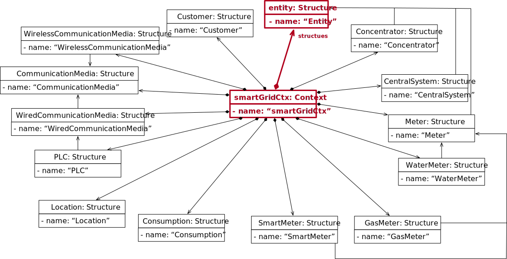
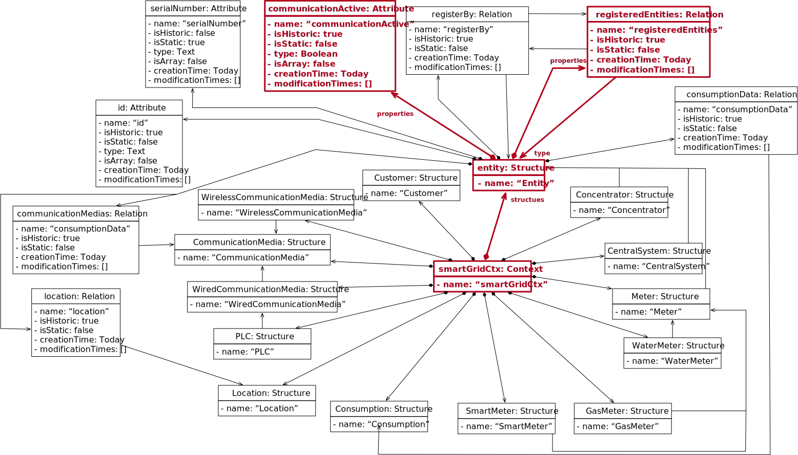
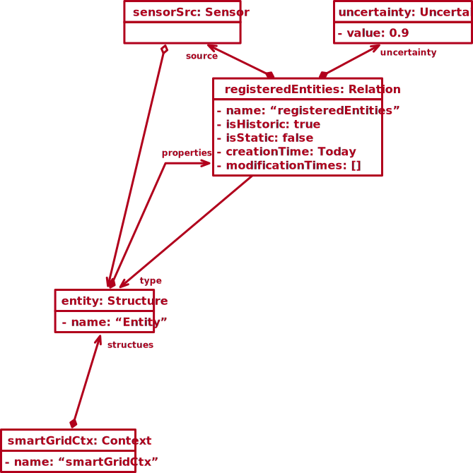

Model Example: SmartGrid at Luxembourg
--------------------------------------

To allow interactive diagnosis of adaptive systems, we developed a model-based solution.
In this example, we will describe how to use our solution on a smart grid system.
We will first describe a smart grid example, then the different steps that engineers will have to do to use our approach.
As this approach is a Model-Driven Engineering (MDE), using our approach mainly means instantiating the proposed meta-model.
**Disclaimer:** We have not developed any specific language to instantiate easily our meta-model. To do so, an engineer will have to use our basic Java or javascript API.
To show how to instantiate our meta-model, we describe both an object model and a Java code. The complete object model can be seen here (**TODO**) and the Java code [here](src/main/java).

## Description of the example

The National Institute of Standards and Technology (NIST) defines smart grids as "a modernized grid that enables bidirectional flows of energy and uses two-way communication and **control capabilities** that will lead to a collection of **new functionalities and applications**".
These capabilities, functionalities, and applications can be implemented using approaches developed by the adaptive system community [1].

Hartmann et al., [2] described the smart grid at Luxembourg with three elements: central system, concentrator, and smart meters.
Smart meters regularly measure resource consumption (water, gas, or electricity) and report them to the central systems through the concentrator.
A smart meter can also modify the maximal consumption or even cut off the resource.
In addition to storing the consumption data, concentrators autonomously manage smart meters according to the configuration sent by the central system.

Among the different goals of concentrators, they have to avoid any overload on the network.
They have two action points: either on the production side or the consumption side.
They can reduce or increase the production by (dis)connecting production unit or the consumption by modifying the maximally allowed consumption.
However, as all adaptive systems, smart grids are prone to failures [1].

Using our approach, an engineer or a system could try to answer the following questions:

- what goal(s) the system was trying to reach by cutting off the power consumption of the building B?
- when the system has decided to reduce the power consumption of M. and Mrs. X, what was the load of the network of their districts?
- when the system has decided to connect the production unit, what was the expected network load?
- yesterday, there was an overload in the district Z, what were the decisions that have modified the network load during all the previous day?

## Step 1: Describing the adaptation process at design time

### Requirements

### Actions

### Context

<!--  -->

Context meta-model can be seen as a data structure of the collected information about the context (any information relevant for the adaptation process).
Defined at designed time, the values will be created and/or updated at runtime.
Here, we described an object model that instantiated our [context meta-model](../../README.md#graphical-version) and the Java code.
The full version of the object model can be found here (**TODO**) and the Java program [here](src/main/java/snt/das/model/example/smartgrid/context/ContextGen.java).
The presented object model has been built in accordance with the one described by Hartmann et al. in [2].
Here the presented meta-model by Hartmann et al. in [2]:


In this document, we will depicted how to create: the context, one structure (entity), one of its attribute, [...] (**TODO**)

**Creation of the context**:


Java code:
```java
Tasks.newTask()
  .createTypedNode(Context.META.name)
  .setAttribute(Context.NAME.name, Context.NAME.type, "smartGridCtx")
  .setAsVar("Context")
  .updateIndex(Contexts.META.name);
```

**Creation of one structure**:



Java code:
```java
Tasks.newTask()
  .createTypedNode(Structure.META.name)
  .setAttribute(Structure.NAME.name, Structure.NAME.type, "Entity")
  .setAsVar("Entity")
  .readVar("Context")
  .addVarTo(Context.STRUCTURES.name, "Entity")
```

**Creation of one attribute and one relation**:



Java code:
```java
Tasks.newTask()
  // Creation of one relation
  .createTypedNode(Relation.META.name)
  .setAttribute(Relation.NAME.name, Relation.NAME.type, "registeredEntities")
  .setAttribute(Relation.ISHISTORIC.name, Relation.ISHISTORIC.type, "true")
  .setAttribute(Relation.ISSTATIC.name, Relation.ISSTATIC.type, "false")
  .addVarTo(Relation.TYPEREL.name, "Entity")
  .setAsVar("registeredEntitiesProp")
  .readVar("Entity")
  .addVarTo(Structure.PROPERTIES.name, "registeredEntitiesProp")
  // Creation of one attribute
  .createTypedNode(Attribute.META.name)
  .setAttribute(Attribute.NAME.name, Attribute.NAME.type, "communicationActive")
  .setAttribute(Attribute.ISHISTORIC.name, Attribute.ISHISTORIC.type, "true")
  .setAttribute(Attribute.ISSTATIC.name, Attribute.ISSTATIC.type, "false")
  .setAttribute(Attribute.TYPEATT.name, Attribute.TYPEATT.type, Constants.TYPE_BOOLEAN)
  .setAttribute(Attribute.ISARRAY.name, Attribute.ISARRAY.type, "false")
  .setAsVar("currentProperty")
  .readVar("Entity")
  .addVarTo(Structure.PROPERTIES.name, "currentProperty");
```

**Creation of a source**:


```java
Tasks.newTask()
  .createTypedNode(Sensor.META.name)
  .addVarTo(Sensor.STRUCTINFO.name, "Entity")
  .setAsVar("currentSrc")
  .readVar("registeredEntitiesProp")
  .addVarTo(Property.SOURCE.name, "currentSrc");
```

**Creation of an uncertainty**:



```java
Tasks.newTask()
  .createTypedNode(Uncertainty.META.name)
  .setAttribute(Uncertainty.VALUE.name, Uncertainty.VALUE.type, "0.9")
  .setAsVar("currentUC")
  .readVar("registeredEntitiesProp")
  .addVarTo(Relation.UNCERTAINTY.name, CURRENT_UC);
```


### Knowledge

## Step 2: Creating procedure to update the model with logging values at runtime

## Step 3: Query the model to diagnose a self adaptive system at runtime


## References

[1] Hartmann, T., Fouquet, F., Klein, J., Nain, G., & Le Traon, Y. (2014, February). Reactive security for smart grids using models@ run. time-based simulation and reasoning. In International Workshop on Smart Grid Security (pp. 139-153). Springer, Cham.

[2] Hartmann, T., Fouquet, F., Klein, J., Le Traon, Y., Pelov, A., Toutain, L., & Ropitault, T. (2014, November). Generating realistic smart grid communication topologies based on real-data. In Smart Grid Communications (SmartGridComm), 2014 IEEE International Conference on (pp. 428-433). IEEE.
